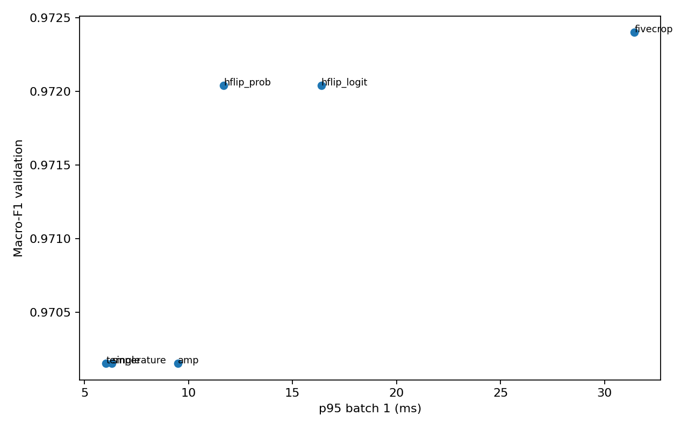
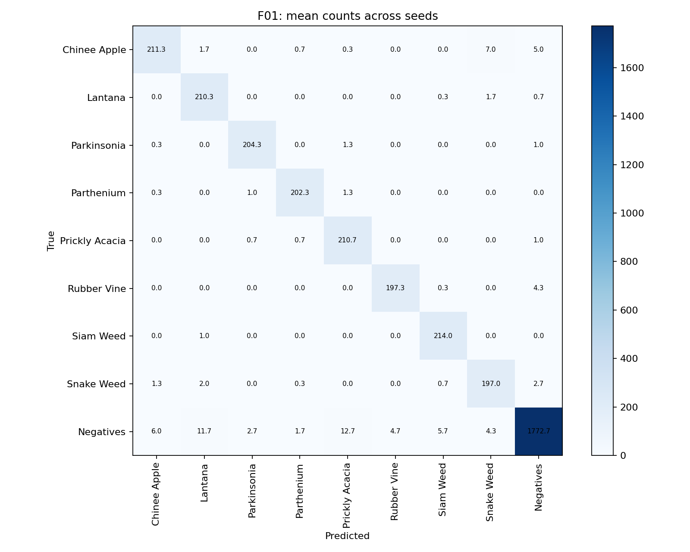
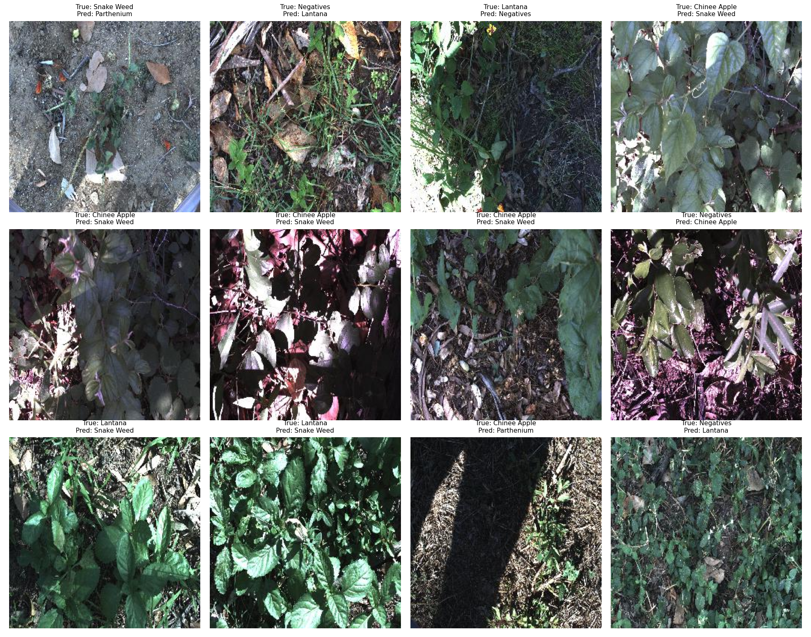

# Báo cáo DeepWeeds — kết quả chạy thật

> Bản tổng hợp tự động. Bổ sung diễn giải ảnh lỗi, giả thuyết và hạn chế trước khi nộp.

## Dữ liệu và thiết lập

Fold 0 gốc; train/val/test tách biệt. Chọn cấu hình chỉ bằng validation macro-F1. Chia ngẫu nhiên không theo địa điểm có thể làm kết quả lạc quan.

Cấu hình baseline: `{"exp_id": "T00", "seed": 0, "fold": 0, "backbone": "convnext_tiny", "init": "finetune", "drop_rate": 0.0, "img_size": 224, "aug": "basic", "sampler": null, "mix": null, "mix_alpha": 1.0, "loss": "ce", "label_smoothing": 0.0, "focal_gamma": 2.0, "class_weight_beta": null, "epochs": 12, "batch_size": 32, "lr_backbone": 0.0001, "lr_head": 0.001, "weight_decay": 0.05, "warmup_epochs": 1.0, "ema_decay": null, "amp": true, "num_workers": 2, "images_dir": "/kaggle/input/datasets/imsparsh/deepweeds/images", "labels_dir": "/kaggle/input/datasets/imsparsh/deepweeds/labels", "out_dir": "/kaggle/working/deepweeds_lab/runs", "pred_dir": "/kaggle/working/deepweeds_lab/predictions", "curves_dir": "/kaggle/working/deepweeds_lab/curves", "save_test_predictions": false, "pretrained": true, "optimizer": "adamw"}`

## Backbone

| exp_id   | backbone               |   macro_f1 |     top1 |   params_m |     gmac |   train_seconds |
|:---------|:-----------------------|-----------:|---------:|-----------:|---------:|----------------:|
| B01      | resnet50               |   0.819384 | 0.869466 |   23.5265  | 4.10948  |         48.9389 |
| B02      | resnext50_32x4d        |   0.843861 | 0.884033 |   22.9983  | 4.25735  |         63.8115 |
| B03      | convnext_tiny          |   0.965014 | 0.972865 |   27.827   | 4.46968  |         56.6093 |
| B04      | deit_small_patch16_224 |   0.951492 | 0.966295 |   21.6691  | 4.60796  |         38.2184 |
| B05      | efficientnet_b0        |   0.812513 | 0.854899 |    4.01908 | 0.398084 |         32.2997 |

## Huấn luyện

| exp_id   | axis        | changed                                |   macro_f1 |    delta_f1 |
|:---------|:------------|:---------------------------------------|-----------:|------------:|
| T00      | baseline    | {}                                     |   0.965014 |  0          |
| T01      | A/init      | {"init": "scratch"}                    |   0.361726 | -0.603288   |
| T02      | A/init      | {"init": "frozen"}                     |   0.851876 | -0.113139   |
| T03      | B/mix       | {"mix": "cutmix"}                      |   0.970152 |  0.00513763 |
| T04      | B/aug       | {"aug": "color"}                       |   0.963413 | -0.00160174 |
| T05      | C/loss      | {"loss": "ls", "label_smoothing": 0.1} |   0.962575 | -0.00243954 |
| T06      | C/loss      | {"loss": "focal"}                      |   0.960131 | -0.00488317 |
| T07      | C/loss      | {"loss": "ce_weighted"}                |   0.956771 | -0.00824329 |
| T08      | combination | {"mix": "cutmix"}                      |   0.970152 |  0.00513763 |

Sàng lọc dùng một seed; chưa coi chênh lệch nhỏ là bằng chứng chắc chắn.

## Suy luận

| method      |   macro_f1 |     top1 |        ece |      p95 |   relative_cost |
|:------------|-----------:|---------:|-----------:|---------:|----------------:|
| single      |   0.970152 | 0.976292 | 0.0080656  |  6.32421 |        1        |
| hflip_prob  |   0.97204  | 0.978006 | 0.00458752 | 11.6987  |        1.81254  |
| fivecrop    |   0.9724   | 0.978292 | 0.00537395 | 31.4294  |        4.61762  |
| hflip_logit |   0.97204  | 0.978006 | 0.00596988 | 16.3803  |        1.8509   |
| temperature |   0.970152 | 0.976292 | 0.00652782 |  6.04092 |        0.933691 |
| amp         |   0.970152 | 0.976292 | 0.00888676 |  9.48659 |        1.42603  |

Cấu hình được chọn: T03, convnext_tiny; suy luận fivecrop.

## Chung kết

| exp_id   |   macro_f1_mean |   macro_f1_std |   top1_mean |   top1_std |   ece_mean |    ece_std |   macro_f1_val_mean |   macro_f1_val_std |
|:---------|----------------:|---------------:|------------:|-----------:|-----------:|-----------:|--------------------:|-------------------:|
| F01      |        0.969585 |     0.00314168 |    0.975192 | 0.00261339 | 0.00686505 | 0.0021872  |            0.968636 |         0.00447506 |
| T00      |        0.966933 |     0.00572289 |    0.974242 | 0.00442969 | 0.0155776  | 0.00345903 |            0.964721 |         0.00031119 |

Δ macro-F1 test = 0.002652; std lớn nhất = 0.005723. Chưa có bằng chứng cải thiện vượt nhiễu.

Chênh lệch tuyệt đối val/test trung bình: 0.001204. ECE trước/sau: 0.006568/0.006865.

p95 chung kết batch 1 trung bình: 31.26 ms. Đạt ngân sách 100 ms trên phần cứng đã đo.

- T00: Chinee Apple -> Snake Weed = 5.0; chiều ngược lại = 1.7 ảnh trung bình/seed.

- F01: Chinee Apple -> Snake Weed = 7.0; chiều ngược lại = 1.3 ảnh trung bình/seed.

## Kết luận và hạn chế

Đối chiếu results.xlsx để giải thích yếu tố đóng góp nhiều nhất, cộng dồn/triệt tiêu và lựa chọn cho robot. Không suy diễn FLOPs thành độ trễ. Khác biệt kiến trúc còn chịu ảnh hưởng của bộ trọng số tiền huấn luyện.

Chỉ một fold; chưa kiểm chứng địa điểm/mùa mới. Tái lập dùng seed cố định nhưng kernel GPU có thể vẫn không hoàn toàn xác định. Loss train là objective đang thử, loss val luôn CE; không so trực tiếp trị số của hai loại loss khác nhau.

## Phụ lục

Cấu hình/log/checkpoint: runs/<exp_id>/seed<k>. Chi tiết chấm chính thức: eval_out/ và grade.txt.